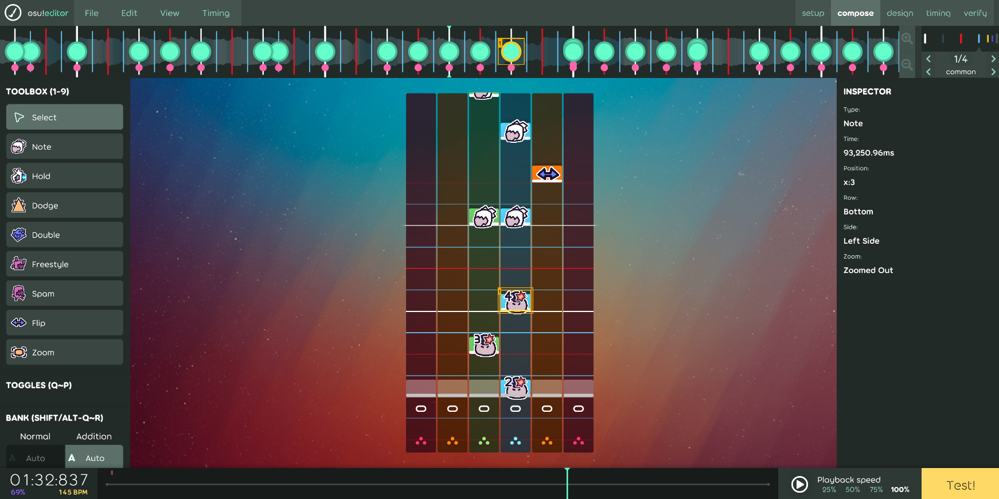

# Unbeatable Osu Editor

A custom osu!(lazer) ruleset that makes creating UNBEATABLE beatmaps easier. Based on the osu!mania ruleset and editor.

## Installation

> [!TIP]
> You can download the latest version of the ruleset from the [releases page](https://github.com/ErikGXDev/UnbeatableOsuEditor/releases).

The ruleset consists of a zip file containing 3 files that you need to extract into the `rulesets` folder of your osu!lazer installation.

### Installation instructions

1. Navigate to the osu!lazer data directory. You can do so by opening the settings panel in osu!lazer and clicking on the "open osu! folder" button. Alternatively you can directly navigate to the `rulesets` directory via your OS directory explorer at the following locations:

   - `%AppData%/osu/rulesets` on Windows
   - `~/.local/share/osu/rulesets` on Linux / macOS

   **NOTE**: If you have relocated your osu! data directory to another directory, the `rulesets` directory will be there instead.

2. Extract the ruleset's zip file contents into the `rulesets` directory.

3. Start osu!lazer and begin creating by selecting the ruleset in the top left and entering the editor.
   If osu!lazer was running while installing the ruleset, you may need to restart the game in order for the ruleset to appear.

4. Settings like key count are already set up for you, so you can immediately start mapping.

## Features

- Simple note presets: Remembering and manually setting samples no longer required
- Note modifier menus: Easily customize notes
- In-editor note preview: See the type and modifiers of any note
- Column guides: Make sure you place notes where they belong
- Inspector: Easily check what side the notes are currently on.
- Simple export options: Export as your map as .zip or playtest directly in UNBEATABLE
- Cute icons
- Everything else the osu!mania editor has to offer (composition, timing, great ui)

> [!NOTE]
> Playtesting a map in UNBEATABLE through the Editor requires installing [this mod](https://github.com/ErikGXDev/UnbeatableWebsocket) for the game.

## Screenshot

_The standard interface of the editor. Use the tools on the left to select and place notes. Placed notes will show their respective icons and modifiers._

_Select a single note to see its properties. You can also check what side it will spawn on, and if the camera is zoomed out (centered)._

## Credits

Heavily adapts the osu!mania ruleset from [osu!(lazer)](https://github.com/ppy/osu) (Licensed under MIT)

Installation instructions adapted from [Rush ruleset](https://github.com/Beamographic/rush) (Licensed under MIT)
