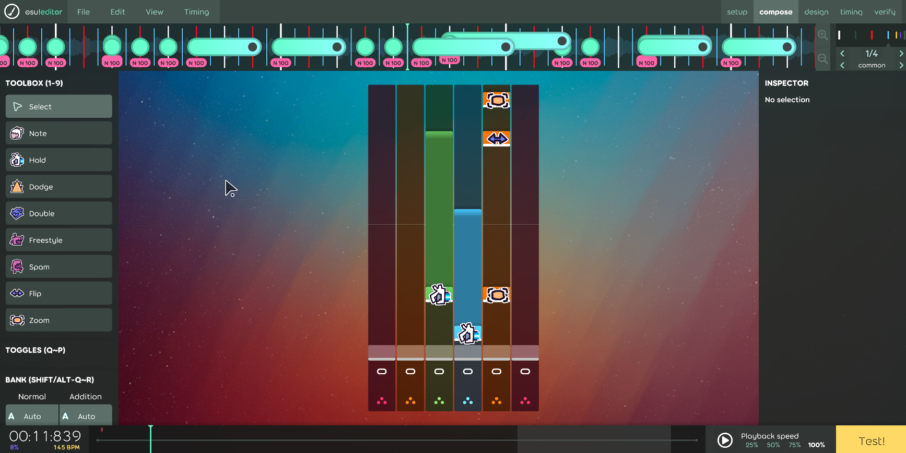

# Unbeatable Osu Editor

A custom osu!(lazer) ruleset that makes creating UNBEATABLE beatmaps easier.

> [!WARNING]  
> This ruleset adds additionally patches that make the game think that it is the same as the original osu!mania ruleset (this is done to enable saving in the editor). Although the rulesets can co-exist at the same time, some downloaded beatmaps may behave differently when this ruleset is installed.

## Features

- Simple note presets: remembering and manually setting samples no longer required
- Note modifier menus: easily customize notes
- In-editor note preview: see the type and modifiers of any note
- Column guides: Make sure you place notes where they belong
- Simple export options: Export as .zip or playtest directly in UNBEATABLE
- Cute icons
- Everything else the osu!mania editor has to offer (composition, timing, great ui)

## Screenshot

## Credits

Heavily adapts the osu!mania ruleset from [osu!(lazer)](https://github.com/ppy/osu) (Licensed under MIT)
